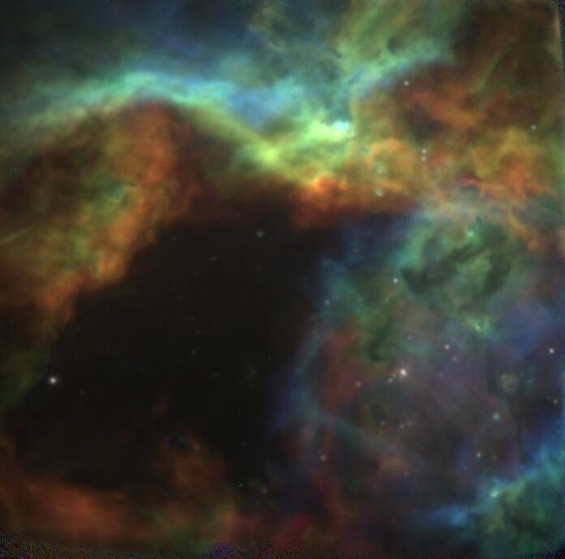

* Analysis of the SOAR Fabry-Perot cube of 30 Doradus

We are going to try out using SCOUSEPY and ACORNS

** Pre-processing the cube

Do the astrometric alignment and continuum subtraction
#+begin_src sh
  uv run scripts/fix-soar-cube.py
#+end_src

#+RESULTS:

Do the spatial rebinning

#+begin_src sh :results verbatim
  uv run scripts/rebin-soar-cube.py
#+end_src

#+RESULTS:
: Original shape: (40, 689, 697)
: Padded shape: (40, 704, 704)
: Saving /Users/will/Dropbox/tarantula-soar-cubo/soar-30dor-ha-cube-lsrk-csub-bin002.fits
: Saving /Users/will/Dropbox/tarantula-soar-cubo/soar-30dor-ha-cube-lsrk-csub-bin004.fits
: Saving /Users/will/Dropbox/tarantula-soar-cubo/soar-30dor-ha-cube-lsrk-csub-bin008.fits
: Saving /Users/will/Dropbox/tarantula-soar-cubo/soar-30dor-ha-cube-lsrk-csub-bin016.fits
: Saving /Users/will/Dropbox/tarantula-soar-cubo/soar-30dor-ha-cube-lsrk-csub-bin032.fits

** Original data files
- These are stored in a separate folder outside the repository:
  - [[file:../tarantula-soar-cubo/][Local link]] (on Will's machines)
  - [[https://www.dropbox.com/scl/fo/19vyrd0pyyi0ul1uwu5vq/ANLCcFdenZI3tGeaR49ogyE?rlkey=jltyde6xwal4wbeev9rxkxy88&dl=0][Dropbox link]]
- The data cube is ~new_cube30Dor_SOAR_invertedY_NEWWAVELENGTH.fits~
- The astrometric alignment of cube is not quite right
  - A better alignment is given in the separate files
    - soar-wav.wcs
    - soar-vlsrk.wcs
  - The first is in wavelength (heliocentric frame), the second is in velocities in LSR frame
    - This is to facilitate comparison with radio data (CO and H I)
    - Transformation is V(HEL) = V(LSRK) + 15.49 km/s
      
#+begin_src sh :results verbatim
  ls -lh ../tarantula-soar-cubo
#+end_src

#+RESULTS:
#+begin_example
total 552216
-rw-r--r--@  1 will  staff    57K Sep  5 22:54 30dor-lo-res-all-2026-09-05.bck
drwxr-xr-x@ 13 will  staff   416B Sep  5 22:54 30dor-lo-res-all-2026-09-05.bck.dir
-rw-r--r--@  1 will  staff    65K Sep  8 22:27 30dor-lo-res-all-2026-09-08.bck
drwxr-xr-x@ 17 will  staff   544B Sep  8 22:27 30dor-lo-res-all-2026-09-08.bck.dir
-rw-r--r--@  1 will  staff    69K Sep 19 17:20 30dor-lo-res-all-2026-09-19.bck
drwxr-xr-x@ 18 will  staff   576B Sep 19 17:20 30dor-lo-res-all-2026-09-19.bck.dir
-rw-r--r--@  1 will  staff    97K Oct  3 17:15 30dor-lo-res-all-2026-10-03.bck
drwxr-xr-x@ 29 will  staff   928B Oct  3 17:16 30dor-lo-res-all-2026-10-03.bck.dir
-rw-r--r--@  1 will  staff    73M May 19 07:52 new_cube30Dor_SOAR_invertedY_NEWWAVELENGTH.fits
-rw-r--r--@  1 will  staff    27K May 20 09:41 soar-30dor-cube-2025-05-20.bck
drwxr-xr-x@  3 will  staff    96B May 20 09:41 soar-30dor-cube-2025-05-20.bck.dir
-rw-r--r--@  1 will  staff   1.8M Oct  5 09:59 soar-30dor-ha-cont.fits
-rw-r--r--@  1 will  staff    76M Oct  4 10:59 soar-30dor-ha-cube-lsrk-csub-bin002.fits
-rw-r--r--@  1 will  staff    19M Oct  4 10:59 soar-30dor-ha-cube-lsrk-csub-bin004.fits
-rw-r--r--@  1 will  staff   4.8M Oct  4 10:59 soar-30dor-ha-cube-lsrk-csub-bin008.fits
-rw-r--r--@  1 will  staff   1.2M Oct  4 10:59 soar-30dor-ha-cube-lsrk-csub-bin016.fits
-rw-r--r--@  1 will  staff    73M Oct  5 09:59 soar-30dor-ha-cube-lsrk-csub.fits
-rw-r--r--@  1 will  staff   1.8M Oct  5 09:59 soar-30dor-ha-ew.fits
-rw-r--r--@  1 will  staff   1.8M Oct  5 09:59 soar-30dor-ha-sum.fits
-rw-r--r--@  1 will  staff    27K May 20 09:42 soar-30dor-pv-ns-2025-05-20.bck
drwxr-xr-x@  3 will  staff    96B May 20 09:42 soar-30dor-pv-ns-2025-05-20.bck.dir
-rw-r--r--@  1 will  staff   5.5M Sep 23 12:45 soar-chan-vlsr-225.fits
-rw-r--r--@  1 will  staff   5.5M Sep 23 12:45 soar-chan-vlsr-250.fits
-rw-r--r--@  1 will  staff   5.5M Sep 23 12:43 soar-chan-vlsr-275.fits
-rw-r--r--@  1 will  staff    60K Sep 23 13:23 soar-rgb-275-250-225.jpg
-rw-r--r--@  1 will  staff    22K Sep 23 12:52 soar-slice-vlsr225.jpeg
-rw-r--r--@  1 will  staff    24K Sep 23 12:53 soar-slice-vlsr250.jpeg
-rw-r--r--@  1 will  staff    24K Sep 23 12:54 soar-slice-vlsr275.jpeg
-rw-r--r--@  1 will  staff   1.8K Sep  8 21:28 soar-vlsrk.wcs
-rw-r--r--@  1 will  staff   1.8K Sep  8 21:20 soar-wav.wcs
#+end_example

** RGB image of velocity channels

